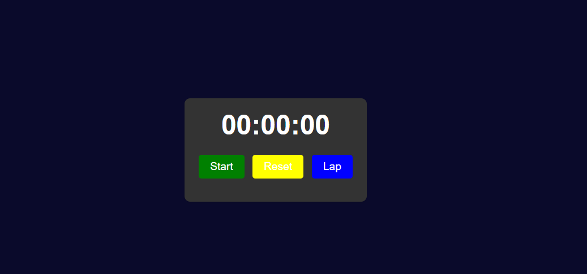

#Stopwatch

A simple stopwatch application built with HTML, CSS, and JavaScript.
#Features

Start, pause, and reset the stopwatch
Lap functionality to record intermediate times
Responsive design that adapts to various screen sizes
#Usage

Clone the repository or download the source files.
Open the index.html file in a web browser.
#Controls

Start/Pause: Starts the timer when clicked, and pauses it when clicked again.
Reset: Resets the timer to 00:00:00.
Lap: Records the current time as a lap and displays it in the lap list.

#Technologies Used

HTML
CSS
JavaScript
Development
If you want to customize or extend the stopwatch application, follow these steps:
Clone the repository: git clone https://github.com/your-username/stopwatch.git  
Open the project in your preferred code editor.
Modify the HTML, CSS, or JavaScript files as needed.
Test your changes by opening the index.html file in a web browser.
Commit your changes and push them to your forked repository.
Submit a pull request to the original repository if you'd like to contribute your changes.
Contributing
If you find any issues or have suggestions for improvements, feel free to open an issue or submit a pull request. Contributions are always welcome!

